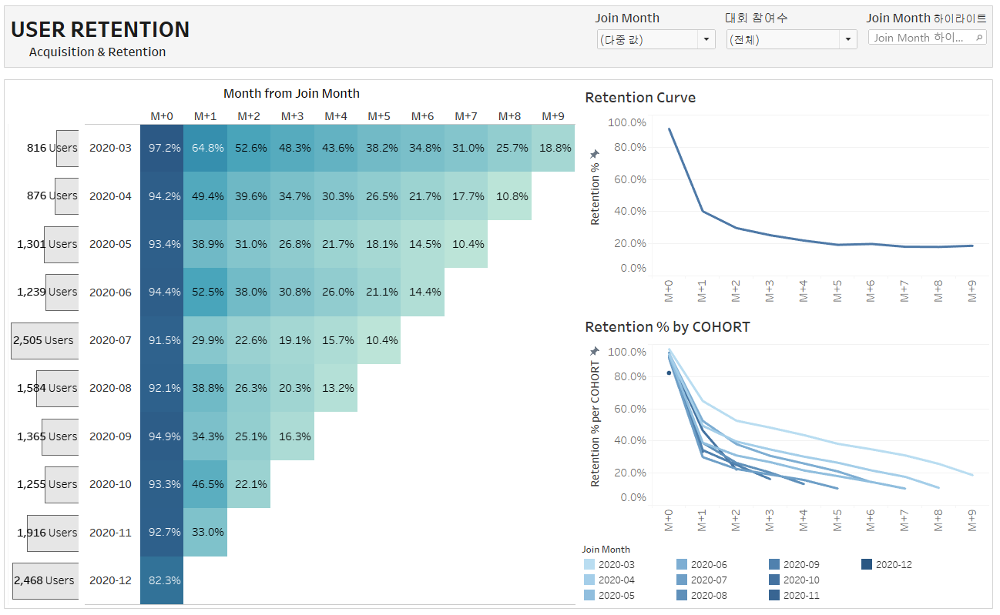

# Dacon User Acquisition & Retention
- Python plotly 시각화 라이브러리를 활용한 유저 행동 데이터 분석
- User Acquisition & Retention에 대한 Tableau 대시보드 제작 
	- 데이콘 대회 사이트 유저의 획득과 유지를 가입일(cohort)에 따라 살펴보며 현황 파악 및 개선 방향 제시
	- 주기적으로 방문하지 않는 대회 사이트 특성을 고려해 Rolling Retention 측정 방법 활용함
```
	유저 행동 데이터를 활용해, 그로스해킹 방법론 중 일부를 적용해보고, Tableau Dashboard 제작 경험을 쌓는 것에 의미가 있음
```

## Dashboard
- url



