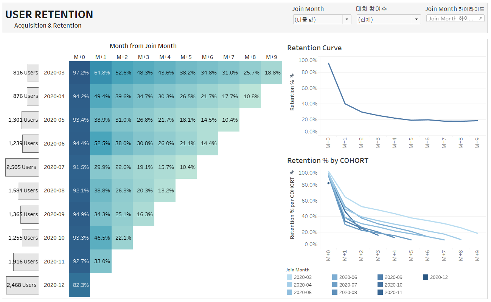

# Dacon User Acquisition & Retention
`#Python` `#Tableau` 
```
	데이콘 유저 행동 데이터를 활용해
	- 유저의 행동 패턴을 분석하고
	- Acquisition & Retention을 가입일(cohort)에 따라 살펴보며 현황 파악 및 개선 방향 제시
		- 주기적으로 방문하지 않는 대회 사이트 특성을 고려해 Rolling Retention 측정 방법 활용함
```

##  Python plotly 시각화 라이브러리를 활용한 유저 행동 데이터 분석
- [nbviewer로 확인](https://nbviewer.jupyter.org/gist/ssujeong/9d76507f1a3abacff6f4249ef1b1604e/Dacon_%EC%9C%A0%EC%A0%80%20%ED%96%89%EB%8F%99%20%EB%B6%84%EC%84%9D.ipynb)
- or 결과 확인용 html을 다운받아 확인


## Dashboard
:point_right: Tableau Dashboard Link: [User Acquisition & Retention](https://public.tableau.com/app/profile/.52832678/viz/UserRetention_16249748567350/1)




